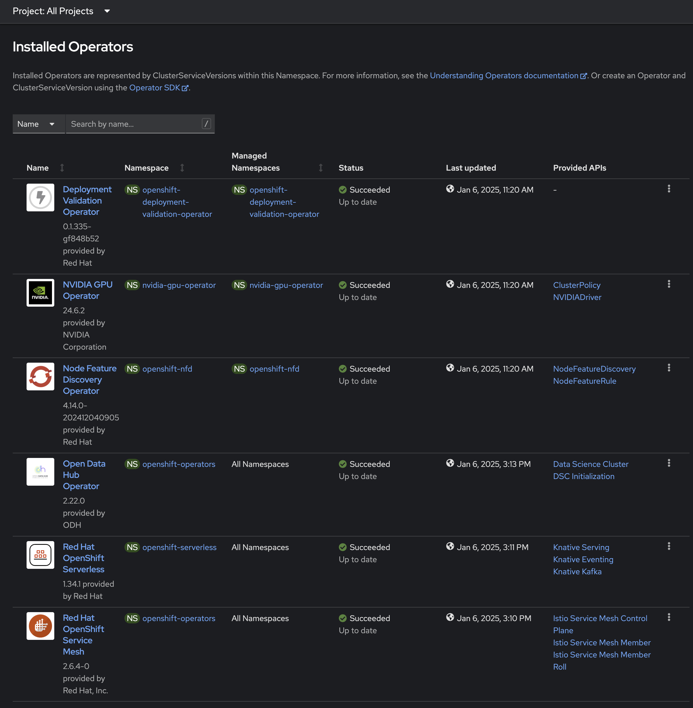

# Deploy Granite on OpendataHub with Grafana Dashboard for GPU and vLLM metrics

# Requirements:

To follow this example you will need:

* Running OCP Cluster with GPU available
* `oc` or `kubectl` command line tools to interact with the OCP Server
* `Podman` or `Docker` Continer Engine

## Required Operators
Deploy ODH in Serverless mode, to do this install these operators in order:

* Red Hat OpenShift Service Mesh (Istio)
* Red Hat OpenShift Serverless
* Authorino (required only if you want to have authentication enabled for inference requests)
* Open Data Hub Operator (at the time of this writing, the version 2.22.0)


Plus, it will require GPU, make sure you have it available in your cluster.

You should have these operators installed:




## Configuring OpendataHub Environment

As next step, let's configure the the ODH operator, to do that, we need to provide two resources:


* The Data Science Cluster Initialization (DSCI)
  * The Operator configuration
* The Data Science Cluster (DSC)
  * THe component's configuration, e.g. defines which components will be enabled. For this example we will use the following:
    * Dashboard (optional)
      * For this example, everything will be deploy manually, with no Dashboard enabled.
    * KServe


The DSCI will looks like (Default configuration):

```yaml
kind: DSCInitialization
apiVersion: dscinitialization.opendatahub.io/v1
metadata:
  labels:
    app.kubernetes.io/created-by: opendatahub-operator
    app.kubernetes.io/instance: default
    app.kubernetes.io/managed-by: kustomize
    app.kubernetes.io/name: dscinitialization
    app.kubernetes.io/part-of: opendatahub-operator
  name: default-dsci
spec:
  applicationsNamespace: opendatahub
  monitoring:
    managementState: Managed
    namespace: opendatahub
  serviceMesh:
    controlPlane:
      metricsCollection: Istio
      name: data-science-smcp
      namespace: istio-system
    managementState: Managed
  trustedCABundle:
    customCABundle: ''
    managementState: Managed
```

Install it and wait the installation to finish, next proceed with the DSC as follows:

The DSC:

```yaml
kind: DataScienceCluster
apiVersion: datasciencecluster.opendatahub.io/v1
metadata:
  labels:
    app.kubernetes.io/created-by: opendatahub-operator
    app.kubernetes.io/instance: default
    app.kubernetes.io/managed-by: kustomize
    app.kubernetes.io/name: datasciencecluster
    app.kubernetes.io/part-of: opendatahub-operator
  name: default-dsc
spec:
  components:
    codeflare:
      managementState: Removed
    dashboard:
      managementState: Removed
    datasciencepipelines:
      managementState: Removed
    kserve:
      managementState: Managed
      nim:
        managementState: Removed
      serving:
        ingressGateway:
          certificate:
            type: OpenshiftDefaultIngress
        managementState: Managed
        name: knative-serving
    kueue:
      managementState: Removed
    modelmeshserving:
      managementState: Removed
    modelregistry:
      managementState: Removed
      registriesNamespace: odh-model-registries
    ray:
      managementState: Removed
    trainingoperator:
      managementState: Removed
    trustyai:
      managementState: Removed
    workbenches:
      managementState: Removed
```

Install it and wait it to get ready. Execute the command below to see the installation status:

```bash
oc get pods -n opendatahub --watch
NAME                                        READY   STATUS    RESTARTS   AGE
kserve-controller-manager-b76cf8c5b-rcqcm   1/1     Running   0          28s
odh-dashboard-7b794bb564-k9ks7              2/2     Running   0          68s
odh-dashboard-7b794bb564-txg5v              2/2     Running   0          68s
odh-model-controller-754f494b86-bfm78       1/1     Running   0          69s
```

KServe, Dashboard and odh-model-controller should be in the running state, If you en counter problems, check the logs of the `opendatahub-operator` in the `openshift-operators` namespace.


## Configuring the Runtime.

For this example, we will be using the default Runtime for vLLM provided by the ODH Model Controller, can be found [here](https://github.com/opendatahub-io/odh-model-controller/blob/incubating/config/runtimes/vllm-template.yaml) as template.

Use this command to install the Serving Runtime:

```bash
oc new-project granite
oc apply -f serving-runtime.yaml
```

Check if it was installed:

```bash
oc get servingruntimes
NAME           DISABLED   MODELTYPE   CONTAINERS         AGE
vllm-runtime              vLLM        kserve-container   86s
```


## Preparing the OCI container

As vLLM models tends to be big, we will be using the OCI feature, which consists in a pré-build container image with the Model already in it. It will save a lot of time during the startup time.

### Preparing the OCI container

As first step, make sure the OCI feature is enabled (it should be enabled by default):

```bash
 oc get cm/inferenceservice-config -n opendatahub -oyaml | grep enableModelcar
...
        "enableModelcar": true
```


Now, let's prepare the OCI image by creating a image. This is a multistep container that will download the model and copy to the OCI container. Inspect the [Containerfile](Containerfile)

```
podman build --format=oci --squash \
  --build-arg repo_id=ibm-granite/granite-3.1-8b-instruct \
  -t quay.io/spolti/granite-3.1-8b:instruct .
```

Remember to update the registry address to fir your needs.

Then push it to your preferred registry.

**Tip**: If the registry requires auth, there is a neew to configure a pull secret.


## Deploying the Inference Service

Now it is time to deploy the Model and start sending requests to it.

Use [inference service](inference-service.yaml) to deploy it.

```bash
oc apply -f inference-service.yaml
```

**Tip:** If you used a different example image, update the yaml to reflet it.

Once it is deployed check if the isvc is ready.

```bash

```
