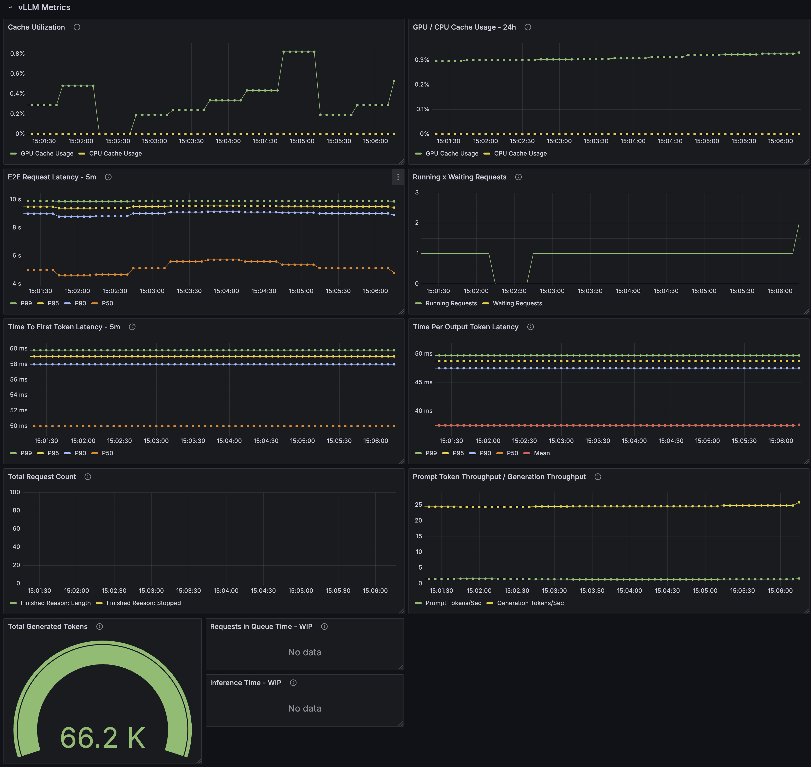

# Accelerators Metrics

This example aims to provide a quick how-to guide about getting the most important metrics related to GPU consumption and vLLM performance when using Large Language Models.
At this point, it is assumed that you already have the Red Hat OpenShift AI platform running and some LLM model deployed.

You can follow the steps described in the [Granite-vLLM](../../Granite-vLLM/README.md) directory to install a LLM for testing.


## Metrics

The `namespace` and `model_name` are variables defined inside the board, and it is defined as:

```yaml
          {
            "current": {
              "text": "${NAMESPACE}",
              "value": "${NAMESPACE}"
            },
            "description": "",
            "hide": 1,
            "name": "namespace",
            "options": [
              {
                "selected": true,
                "text": "${NAMESPACE}",
                "value": "${NAMESPACE}"
              }
            ],
            "query": "${NAMESPACE}",
            "type": "textbox"
          },
          {
            "current": {
              "text": "${MODEL_NAME}",
              "value": "${MODEL_NAME}"
            },
            "hide": 2,
            "name": "model_name",
            "query": "${MODEL_NAME}",
            "skipUrlSync": true,
            "type": "constant"
          }
        ]
```

Note, these needs to be updated before or after the deployment, to update it follow the steps below:
We will use the `envsubst` command to replace the variables in the JSON string with the actual values provided in the 
[inputs.env](inputs.env) file, example:

```bash
# the following command reads the environment variables from the inputs.env file and exports them to the current shell
# so it can be used by the envsubst command
export $(cat inputs.env | xargs)
envsubst '${NAMESPACE} ${MODEL_NAME}' < assets/vllm-gpu-metrics-dashboard.yaml > /tmp/vllm-gpu-metrics-dashboard.yaml-replaced.yaml
```

As example, the `inputs.env` file contains this values:
```bash
NAMESPACE=granite
MODEL_NAME=granite318b
```

These values will be replaced by its placeholders in the [dashboard](vllm-gpu-metrics-dashboard.yaml), in the end of
the generated file, pay attention to this section, where the `namespace` and `model_name` inputs are defined:

```json
       {
            "current": {
              "text": "granite",
              "value": "granite"
            },
            "description": "",
            "hide": 1,
            "name": "namespace",
            "options": [
              {
                "selected": true,
                "text": "granite",
                "value": "granite"
              }
            ],
            "query": "granite",
            "type": "textbox"
          },
          {
            "current": {
              "text": "granite318b",
              "value": "granite318b"
            },
            "hide": 2,
            "name": "model_name",
            "query": "granite318b",
            "skipUrlSync": true,
            "type": "constant"
          }
        ]
      },
```

Notice that the model_name and namespace dashboards variables were updated to the values from `inputs.env` file.

> The installation will happen in the end of this tutorial.

### Accelerator Metrics

#### Nvidia

- **GPU Utilization**: Tracks the percentage of time the GPU is actively processing tasks, indicating GPU workload levels.
  - Query: `DCGM_FI_DEV_GPU_UTIL{instance=~"$instance", gpu=~"$gpu"}`
- **GPU Power Usage**: GPU Total Power - The SUM of the power read from all sensors
  Query: `sum(DCGM_FI_DEV_POWER_USAGE{instance=~\"$instance\", gpu=~\"$gpu\"})`
- **GPU Memory Utilization**: Shows memory usage vs free memory, critical for identifying memory bottlenecks in GPU-heavy workloads.
  - Query: `DCGM_FI_DEV_MEM_COPY_UTIL{instance=~"$instance", gpu=~"$gpu"}`
  - Sum: `sum(DCGM_FI_DEV_MEM_COPY_UTIL{instance=~"$instance", gpu=~"$gpu"})`
    - Range: The value is typically a percentage from 0% to 100%.
      - 0%: The memory copy engines are completely idle.
      - 100%: The memory copy engines are fully utilized, meaning they were busy transferring data for the entire sampling period.
    - High Utilization (e.g., close to 100%): This indicates that the GPU is spending a significant amount of its time moving data. This isn't inherently good or bad, but it needs to be considered in context:
      - If MEM_COPY_UTIL is high while compute utilization (e.g., DCGM_FI_DEV_GPU_UTIL or DCGM_FI_GR_ENGINE_ACTIVE) is low, it could suggest that your application is memory bandwidth bound. The GPU might be waiting for data to arrive or be sent out, rather than performing computations. This could be a bottleneck.

- **GPU** Temperature: Ensures the GPU operates within safe thermal limits to prevent hardware degradation.
  - Query: `DCGM_FI_DEV_GPU_TEMP{instance=~"$instance", gpu=~"$gpu"}`
  - Avg: `avg(DCGM_FI_DEV_GPU_TEMP{instance=~"$instance", gpu=~"$gpu"})`
- **GPU Throttling**: It occurs when the GPU automatically reduces the clock to avoid damage from overheating
  - Key Metrics to Visualize:
    - GPU Temperature: Monitor the GPU temperature. Throttling often occurs when the GPU reaches a certain temperature (e.g., 85-90°C)2.
    - SM Clock Speed: Observe the core clock speed. A significant drop in the clock speed while the GPU is under load indicates throttling.
      - `DCGM_FI_DEV_SM_CLOCK{instance=~\"$instance\", gpu=~\"$gpu\"} * 1000000`

- **CPU-GPU Bottlenecks**: `container_cpu_cfs_throttled_seconds_total` + `DCGM_FI_DEV_GPU_UTIL`: A combination of CPU throttling and GPU usage metrics to identify resource allocation inefficiencies.
  - If CPU throttling is low and GPU utilization is high, it indicates that the system is well-balanced, with the GPU being fully utilized without CPU constraints. 
  If CPU throttling is high and GPU utilization is low, it indicates a CPU bottleneck. The CPU is unable to keep up with the GPU's processing demands, causing the GPU to remain underutilized. If both metrics are high, it may indicate that the workload is demanding for both CPU and GPU, and you may need to scale up resources.
  - Queries:
    - `sum(rate(container_cpu_cfs_throttled_seconds_total{namespace="$namespace", pod=~"$model_name.*"}[5m])) by (namespace)`
    - `avg_over_time(DCGM_FI_DEV_GPU_UTIL{instance=~"$instance", gpu=~"$gpu"}[5m])`

 
    
- **CPU-GPU Bottlenecks**: `container_cpu_cfs_throttled_seconds_total` + `DCGM_FI_DEV_GPU_UTIL`: A combination of CPU throttling and GPU usage metrics to identify resource allocation inefficiencies.
  - If CPU throttling is low and GPU utilization is high, it indicates that the system is well-balanced, with the GPU being fully utilized without CPU constraints. 
  If CPU throttling is high and GPU utilization is low, it indicates a CPU bottleneck. The CPU is unable to keep up with the GPU's processing demands, causing the GPU to remain underutilized. If both metrics are high, it may indicate that the workload is demanding for both CPU and GPU, and you may need to scale up resources.
  - Queries:
    - `sum(rate(container_cpu_cfs_throttled_seconds_total{namespace="$namespace", pod=~"$model_name.*"}[5m])) by (namespace)`
    - `avg_over_time(DCGM_FI_DEV_GPU_UTIL{instance=~"$instance", gpu=~"$gpu"}[5m])`

 
### vLLM Metrics
- **GPU / CPU Cache Utilization**: Tracks the percentage of GPU memory used by the vLLM model, providing insights into memory efficiency.
  - Query: `sum_over_time(vllm:gpu_cache_usage_perc{namespace="${namespace}",pod=~"$model_name.*"}[24h])`

#### Request and Resource Utilization Metrics
- **Waiting x Running Requests**
  - *Running Requests*: The number of requests actively being processed; helps monitor workload concurrency.
    - `num_requests_running{namespace="$namespace", pod=~"$model_name.*"}`
  - *Waiting Requests*: Tracks requests in the queue, indicating system saturation.
    - `num_requests_waiting{namespace="$namespace", pod=~"$model_name.*"}`

- **Prefix Cache Hit Rates**: `vllm:cpu_prefix_cache_hit_rate, vllm:gpu_prefix_cache_hit_rate`: High hit rates imply efficient reuse of cached computations, optimizing resource usage.
  - Queries:
    - `vllm:gpu_cache_usage_perc{namespace="$namespace", pod=~"$model_name.*", model_name="$model_name"}`
    - `vllm:cpu_cache_usage_perc{namespace="$namespace", pod=~"$model_name.*", model_name="$model_name"}`
- **Request Total Count**:
  - Queries:
    - `vllm:request_success_total{finished_reason="length",namespace="$namespace", pod=~"$model_name.*", model_name="$model_name"}`
      - The request ended because it reached the maximum token limit set for the model inference.
    - `vllm:request_success_total{finished_reason="stop",namespace="$namespace", pod=~"$model_name.*", model_name="$model_name"}`
      - The request completed naturally based on the model's output or a stop condition (e.g., end of a sentence or token completion).


#### Performance Metrics
- **End-to-End Latency**: Measures the overall time to process a request, critical for user experience.
  - Queries: Histogram:
    - `histogram_quantile(0.99, sum by(le) (rate(vllm:e2e_request_latency_seconds_bucket{namespace="$namespace", pod=~"$model_name.*", model_name="$model_name"}[5m])))`
    - `histogram_quantile(0.95, sum by(le) (rate(vllm:e2e_request_latency_seconds_bucket{namespace="$namespace", pod=~"$model_name.*", model_name="$model_name"}[5m])))`
    - `histogram_quantile(0.9, sum by(le) (rate(vllm:e2e_request_latency_seconds_bucket{namespace="$namespace", pod=~"$model_name.*", model_name="$model_name"}[5m])))`
    - `histogram_quantile(0.5, sum by(le) (rate(vllm:e2e_request_latency_seconds_bucket{namespace="$namespace", pod=~"$model_name.*", model_name="$model_name"}[5m])))`
    - `rate(vllm:e2e_request_latency_seconds_sum{namespace="$namespace", pod=~"$model_name.*",model_name="$model_name"}[5m])`
      `  /`
      `rate(vllm:e2e_request_latency_seconds_count{namespace="$namespace", pod=~"$model_name.*", model_name="$model_name"}[5m])`

TODO - These two are not yet present in the vllm version used by RHOAI. (https://docs.vllm.ai/en/v0.6.6/serving/metrics.html)
It might be available when we upgrade the vllm server.
- **Request Queue Time**: Indicates potential system overload or scheduling inefficiencies.
  - Query: `rate(vllm:request_queue_time_seconds_sum{namespace="$namespace", pod=~"$model_name.*", model_name="$model_name"}[5m])`
- **Inference Time**: Tracks the time spent in model inference, offering insights into processing efficiency.
  - Query: `rate(vllm:request_inference_time_seconds{namespace="$namespace", pod=~"$model_name.*", model_name="$model_name"}[5m])`

#### Throughput Metrics 
- **Time To First Token (TTFT) Latency**: The time taken to generate the first token in a response.
  - Queries:
    - `histogram_quantile(0.99, sum by(le) (rate(vllm:time_to_first_token_seconds_bucket{namespace="$namespace", pod=~"$model_name.*", model_name="$model_name"}[5m])))`
    - `histogram_quantile(0.95, sum by(le) (rate(vllm:time_to_first_token_seconds_bucket{namespace="$namespace", pod=~"$model_name.*", model_name="$model_name"}[5m])))`
    - `histogram_quantile(0.9, sum by(le) (rate(vllm:time_to_first_token_seconds_bucket{namespace="$namespace", pod=~"$model_name.*", model_name="$model_name"}[5m])))`
    - `histogram_quantile(0.5, sum by(le) (rate(vllm:time_to_first_token_seconds_bucket{namespace="$namespace", pod=~"$model_name.*", model_name="$model_name"}[5m])))`
    - `rate(vllm:time_to_first_token_seconds_sum{namespace="$namespace", pod=~"$model_name.*", model_name="$model_name"}[5m])`
      `/`
      `rate(vllm:time_to_first_token_seconds_count{namespace="$namespace", pod=~"$model_name.*", model_name="$model_name"}[5m])`
- **Time Per Output Token (TPOT) Latency**: The average time taken to generate each output token.
  - `histogram_quantile(0.99, sum by(le) (rate(vllm:time_per_output_token_seconds_bucket{namespace="$namespace", pod=~"$model_name.*", model_name="$model_name"}[5m])))`
  - `histogram_quantile(0.95, sum by(le) (rate(vllm:time_per_output_token_seconds_bucket{namespace="$namespace", pod=~"$model_name.*", model_name="$model_name"}[5m])))`
  - `histogram_quantile(0.9, sum by(le) (rate(vllm:time_per_output_token_seconds_bucket{namespace="$namespace", pod=~"$model_name.*", model_name="$model_name"}[5m])))`
  - `histogram_quantile(0.5, sum by(le) (rate(vllm:time_per_output_token_seconds_bucket{namespace="$namespace", pod=~"$model_name.*", model_name="$model_name"}[5m])))`
  - `rate(vllm:time_per_output_token_seconds_sum{namespace="$namespace", pod=~"$model_name.*", model_name="$model_name"}[5m])`
    `/`
    `rate(vllm:time_per_output_token_seconds_count{namespace="$namespace", pod=~"$model_name.*", model_name="$model_name"}[5m])`

- **Prompt Token Throughput / Generation Throughput**: Tracks the speed of processing prompt tokens, which is essential for LLM optimization.
  - Queries:
    - `rate(vllm:prompt_tokens_total{namespace="$namespace", pod=~"$model_name.*", model_name="$model_name"}[5m])`
    - `rate(vllm:generation_tokens_total{namespace="$namespace", pod=~"$model_name.*", model_name="$model_name"}[5m])`
- **Total Token Generated**: Measures the efficiency of generating response tokens, critical for real-time applications.
  - Query: `sum(vllm:generation_tokens_total{namespace="$namespace", pod=~"$model_name.*", model_name="$model_name"})`


## Deploying the Grafana operator

For this tutorial we will be using the `openshift-user-workload-monitoring` namespace to configure Grafana and deploy the Dashboard.

Execute the Grafana operator using the [deploy-grafana-operator.yaml](../common-assets/deploy-grafana-operator.yaml).
```bash
oc apply -f ../common-assets/deploy-grafana-operator.yaml

# watch the pods and wait until the grafana ones are running:
oc get pods -nopenshift-user-workload-monitoring -w
NAME                                  READY   STATUS    RESTARTS   AGE
prometheus-operator-79c6cf584-75fpm   2/2     Running   0          20h
prometheus-user-workload-0            6/6     Running   0          9h
prometheus-user-workload-1            6/6     Running   0          9h
thanos-ruler-user-workload-0          4/4     Running   0          9h
thanos-ruler-user-workload-1          4/4     Running   0          9h
grafana-operator-controller-manager-v5-7df8b7dbbf-lkmhs   0/1     Pending   0          0s
grafana-operator-controller-manager-v5-7df8b7dbbf-lkmhs   0/1     Pending   0          0s
grafana-operator-controller-manager-v5-7df8b7dbbf-lkmhs   0/1     ContainerCreating   0          0s
grafana-operator-controller-manager-v5-7df8b7dbbf-lkmhs   0/1     ContainerCreating   0          0s
grafana-operator-controller-manager-v5-7df8b7dbbf-lkmhs   0/1     ContainerCreating   0          1s
grafana-operator-controller-manager-v5-7df8b7dbbf-lkmhs   0/1     Running             0          3s
grafana-operator-controller-manager-v5-7df8b7dbbf-lkmhs   1/1     Running             0          10s
```

Considering that you already have Grafana running and followed the steps described [here](../README.md), let's install the GPU & vLLM metrics Dashboard.
All the metrics are together in the same dashboard for easy view.
```bash
oc apply -f /tmp/vllm-gpu-metrics-dashboard.yaml-replaced.yaml # This is the temproary versions with the applied configuration
```

If the Dashboard isn't deployed, inspect the `grafana-operator-controller-manager` logs.

This will install one dashboard with 3 subsections:

- GPU Metrics.
- vLLM Performance Metrics.

# Metrics Dashboard

## GPU Metrics


## vLLM Metrics



If you find any issue, please let us know.