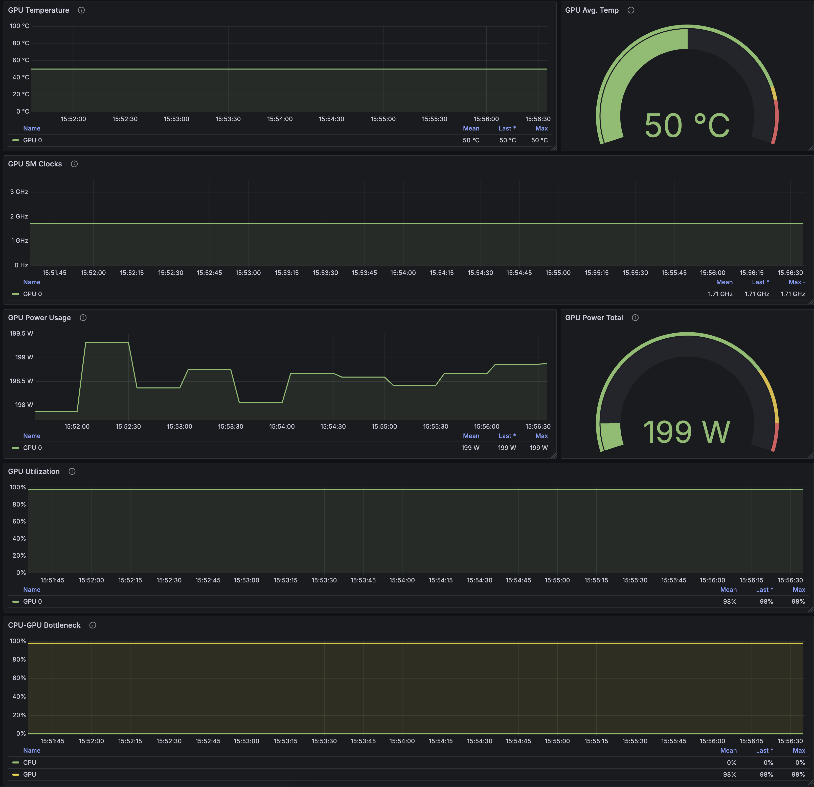

# Accelerators Metrics

This example aims to provide a quick how-to guide about getting the most important metrics related to GPU consumption and vLLM performance when using Large Language Models.
At this point, it is assumed that you already have the Red Hat OpenShift AI platform running and some LLM model deployed.

You can follow the steps described in the [Granite-vLLM](../../Granite-vLLM/README.md) directory to install a LLM for testing.


## Metrics

Below you can find the set of metrics that the provided Grafana board contains.
The `datasource`, `instance` and `gpu` are variables defined inside the board, and it is defined as:

```yaml
{
  "current": {
    "text": [
      "All"
    ],
    "value": [
      "$__all"
    ]
  },
  "datasource": "$datasource",
  "definition": "label_values(DCGM_FI_DEV_GPU_TEMP,gpu)",
  "includeAll": true,
  "multi": true,
  "name": "gpu",
  "options": [],
  "query": "label_values(DCGM_FI_DEV_GPU_TEMP,gpu)",
  "refresh": 1,
  "regex": "",
  "sort": 1,
  "type": "query"
},
{
  "current": {
    "text": "granite",
    "value": "granite"
  },
  "description": "",
  "hide": 1,
  "name": "namespace",
  "options": [
    {
      "selected": true,
      "text": "granite",
      "value": "granite"
    }
  ],
  "query": "granite",
  "type": "textbox"
},
{
  "current": {
    "text": "granite318b",
    "value": "granite318b"
  },
  "hide": 2,
  "name": "model_name",
  "query": "granite318b",
  "skipUrlSync": true,
  "type": "constant"
}
```


### Accelerators Metrics
- **GPU Utilization**: Tracks the percentage of time the GPU is actively processing tasks, indicating GPU workload levels.
  - Query: `DCGM_FI_DEV_GPU_UTIL{instance=~"$instance", gpu=~"$gpu"}`
- **GPU Memory Utilization**: Shows memory usage vs free memory, critical for identifying memory bottlenecks in GPU-heavy workloads.
  - Query: `DCGM_FI_DEV_POWER_USAGE{instance=~"$instance", gpu=~"$gpu"}`
  - Sum: `sum(DCGM_FI_DEV_POWER_USAGE{instance=~"$instance", gpu=~"$gpu"})`
- **GPU** Temperature: Ensures the GPU operates within safe thermal limits to prevent hardware degradation.
  - Query: `DCGM_FI_DEV_GPU_TEMP{instance=~"$instance", gpu=~"$gpu"}`
  - Avg: `avg(DCGM_FI_DEV_GPU_TEMP{instance=~"$instance", gpu=~"$gpu"})`
- **GPU Throttling**: It occurs when the GPU automatically reduces the clock to avoid damage from overheating
  - Key Metrics to Visualize:
    - GPU Temperature: Monitor the GPU temperature. Throttling often occurs when the GPU reaches a certain temperature (e.g., 85-90°C)2.
    - SM Clock Speed: Observe the core clock speed. A significant drop in the clock speed while the GPU is under load indicates throttling.


###  CPU Metrics
- **CPU Utilization**: node:node_cpu_utilisation:avg1m: Tracks CPU usage to identify workloads that are CPU-bound.
  - Query: `sum(rate(container_cpu_usage_seconds_total{namespace="granite", pod=~"granite.*"}[5m])) by (namespace)`
- **CPU-GPU Bottlenecks**: `container_cpu_cfs_throttled_seconds_total` + `DCGM_FI_DEV_GPU_UTIL`: A combination of CPU throttling and GPU usage metrics to identify resource allocation inefficiencies.
  - If CPU throttling is low and GPU utilization is high, it indicates that the system is well-balanced, with the GPU being fully utilized without CPU constraints. 
  If CPU throttling is high and GPU utilization is low, it indicates a CPU bottleneck. The CPU is unable to keep up with the GPU's processing demands, causing the GPU to remain underutilized. If both metrics are high, it may indicate that the workload is demanding for both CPU and GPU, and you may need to scale up resources.
  - Queries:
    - `sum(rate(container_cpu_cfs_throttled_seconds_total{namespace="$namespace", pod=~"granite.*"}[5m])) by (namespace)`
    - `avg_over_time(DCGM_FI_DEV_GPU_UTIL{instance=~"$instance", gpu=~"$gpu"}[5m])`

 
 
### vLLM Metrics
- **GPU / CPU Cache Utilization**: Tracks the percentage of GPU memory used by the vLLM model, providing insights into memory efficiency.
  - Query: `sum_over_time(vllm:gpu_cache_usage_perc{namespace="${namespace}",pod=~"granite.*"}[24h])`

#### Request and Resource Utilization Metrics
- **Waiting x Running Requests**
  - *Running Requests*: The number of requests actively being processed; helps monitor workload concurrency.
    - `num_requests_running{namespace="$namespace", pod=~"granite.*"}`
  - *Waiting Requests*: Tracks requests in the queue, indicating system saturation.
    - `num_requests_waiting{namespace="$namespace", pod=~"granite.*"}`

- **Prefix Cache Hit Rates**: `vllm:cpu_prefix_cache_hit_rate, vllm:gpu_prefix_cache_hit_rate`: High hit rates imply efficient reuse of cached computations, optimizing resource usage.
  - Queries:
    - `vllm:gpu_cache_usage_perc{namespace="$namespace", pod=~"granite.*", model_name="$model_name"}`
    - `vllm:cpu_cache_usage_perc{namespace="$namespace", pod=~"granite.*", model_name="$model_name"}`
- **Request Total Count**:
  - Queries:
    - `vllm:request_success_total{finished_reason="length",namespace="$namespace", pod=~"granite.*", model_name="$model_name"}`
      - The request ended because it reached the maximum token limit set for the model inference.
    - `vllm:request_success_total{finished_reason="stop",namespace="$namespace", pod=~"granite.*", model_name="$model_name"}`
      - The request completed naturally based on the model's output or a stop condition (e.g., end of a sentence or token completion).


#### Performance Metrics
- **End-to-End Latency**: Measures the overall time to process a request, critical for user experience.
  - Queries: Histogram:
    - `histogram_quantile(0.99, sum by(le) (rate(vllm:e2e_request_latency_seconds_bucket{namespace="$namespace", pod=~"granite.*", model_name="$model_name"}[5m])))`
    - `histogram_quantile(0.95, sum by(le) (rate(vllm:e2e_request_latency_seconds_bucket{namespace="$namespace", pod=~"granite.*", model_name="$model_name"}[5m])))`
    - `histogram_quantile(0.9, sum by(le) (rate(vllm:e2e_request_latency_seconds_bucket{namespace="$namespace", pod=~"granite.*", model_name="$model_name"}[5m])))`
    - `histogram_quantile(0.5, sum by(le) (rate(vllm:e2e_request_latency_seconds_bucket{namespace="$namespace", pod=~"granite.*", model_name="$model_name"}[5m])))`
    - `rate(vllm:e2e_request_latency_seconds_sum{namespace="$namespace", pod=~"granite.*",model_name="$model_name"}[5m])`
      `  /`
      `rate(vllm:e2e_request_latency_seconds_count{namespace="$namespace", pod=~"granite.*", model_name="$model_name"}[5m])`

TODO - These two are not yet present in the vllm version used by RHOAI. (https://docs.vllm.ai/en/v0.6.6/serving/metrics.html)
It might be available when we upgrade the vllm server.
- **Request Queue Time**: Indicates potential system overload or scheduling inefficiencies.
  - Query: `rate(vllm:request_queue_time_seconds_sum{namespace="$namespace", pod=~"granite.*", model_name="$model_name"}[5m])`
- **Inference Time**: Tracks the time spent in model inference, offering insights into processing efficiency.
  - Query: `rate(vllm:request_inference_time_seconds{namespace="$namespace", pod=~"granite.*", model_name="$model_name"}[5m])`

#### Throughput Metrics 
- **Time To First Token (TTFT) Latency**: The time taken to generate the first token in a response.
  - Queries:
    - `histogram_quantile(0.99, sum by(le) (rate(vllm:time_to_first_token_seconds_bucket{namespace="$namespace", pod=~"granite.*", model_name="$model_name"}[5m])))`
    - `histogram_quantile(0.95, sum by(le) (rate(vllm:time_to_first_token_seconds_bucket{namespace="$namespace", pod=~"granite.*", model_name="$model_name"}[5m])))`
    - `histogram_quantile(0.9, sum by(le) (rate(vllm:time_to_first_token_seconds_bucket{namespace="$namespace", pod=~"granite.*", model_name="$model_name"}[5m])))`
    - `histogram_quantile(0.5, sum by(le) (rate(vllm:time_to_first_token_seconds_bucket{namespace="$namespace", pod=~"granite.*", model_name="$model_name"}[5m])))`
    - `rate(vllm:time_to_first_token_seconds_sum{namespace="$namespace", pod=~"granite.*", model_name="$model_name"}[5m])`
      `/`
      `rate(vllm:time_to_first_token_seconds_count{namespace="$namespace", pod=~"granite.*", model_name="$model_name"}[5m])`
- **Time Per Output Token (TPOT) Latency**: The average time taken to generate each output token.
  - `histogram_quantile(0.99, sum by(le) (rate(vllm:time_per_output_token_seconds_bucket{namespace="$namespace", pod=~"granite.*", model_name="$model_name"}[5m])))`
  - `histogram_quantile(0.95, sum by(le) (rate(vllm:time_per_output_token_seconds_bucket{namespace="$namespace", pod=~"granite.*", model_name="$model_name"}[5m])))`
  - `histogram_quantile(0.9, sum by(le) (rate(vllm:time_per_output_token_seconds_bucket{namespace="$namespace", pod=~"granite.*", model_name="$model_name"}[5m])))`
  - `histogram_quantile(0.5, sum by(le) (rate(vllm:time_per_output_token_seconds_bucket{namespace="$namespace", pod=~"granite.*", model_name="$model_name"}[5m])))`
  - `rate(vllm:time_per_output_token_seconds_sum{namespace="$namespace", pod=~"granite.*", model_name="$model_name"}[5m])`
    `/`
    `rate(vllm:time_per_output_token_seconds_count{namespace="$namespace", pod=~"granite.*", model_name="$model_name"}[5m])`

- **Prompt Token Throughput / Generation Throughput**: Tracks the speed of processing prompt tokens, which is essential for LLM optimization.
  - Queries:
    - `rate(vllm:prompt_tokens_total{namespace="$namespace", pod=~"granite.*", model_name="$model_name"}[5m])`
    - `rate(vllm:generation_tokens_total{namespace="$namespace", pod=~"granite.*", model_name="$model_name"}[5m])`
- **Total Token Generated**: Measures the efficiency of generating response tokens, critical for real-time applications.
  - Query: `sum(vllm:generation_tokens_total{namespace="$namespace", pod=~"granite.*", model_name="$model_name"})`


## Deploying the Grafana operator

For this tutorial we will be using the `nopenshift-user-workload-monitoring` namespace to configure Grafana and deploy the Dashboard.

Execute the Grafana operator using the [deploy-grafana-operator.yaml](assets/deploy-grafana-operator.yaml).
```bash
oc apply -f assets/deploy-grafana-operator.yaml

# watch the pods and wait until the grafana ones are running:
oc get pods -nopenshift-user-workload-monitoring -w
NAME                                  READY   STATUS    RESTARTS   AGE
prometheus-operator-79c6cf584-75fpm   2/2     Running   0          20h
prometheus-user-workload-0            6/6     Running   0          9h
prometheus-user-workload-1            6/6     Running   0          9h
thanos-ruler-user-workload-0          4/4     Running   0          9h
thanos-ruler-user-workload-1          4/4     Running   0          9h
grafana-operator-controller-manager-v5-7df8b7dbbf-lkmhs   0/1     Pending   0          0s
grafana-operator-controller-manager-v5-7df8b7dbbf-lkmhs   0/1     Pending   0          0s
grafana-operator-controller-manager-v5-7df8b7dbbf-lkmhs   0/1     ContainerCreating   0          0s
grafana-operator-controller-manager-v5-7df8b7dbbf-lkmhs   0/1     ContainerCreating   0          0s
grafana-operator-controller-manager-v5-7df8b7dbbf-lkmhs   0/1     ContainerCreating   0          1s
grafana-operator-controller-manager-v5-7df8b7dbbf-lkmhs   0/1     Running             0          3s
grafana-operator-controller-manager-v5-7df8b7dbbf-lkmhs   1/1     Running             0          10s
```

Now, we need to configure the service account so Grafana can query the `Thanos` endpoint.
To do that, apply the content from [service account role binding](assets/sa-rb.yaml)

This will:
- create the service account `grafana-sa`
- assign the `cluster-monitoring-view` to the service account just created.

```bash
oc apply -f assets/sa-rb.yaml
```

Now, let's get the `serviceAccount` token and store in a secret:
```Bash
SECRET_NAME=$(oc -n openshift-user-workload-monitoring describe sa grafana-sa | awk '/Tokens/{ print $2 }')
# echo $SECRET_NAME
# grafana-sa-token-zsx9b
TOKEN=$(oc -n openshift-user-workload-monitoring get secret $SECRET_NAME --template='{{ .data.token | base64decode }}')
# echo $TOKEN
# eyJhbGciOiJSUzI1NiIsI.....
```

With the Token ready, let's store it into a secret so we can use it in the next step:
```bash
oc apply -f - <<EOF
kind: Secret
apiVersion: v1
metadata:
  name: credentials
  namespace: openshift-user-workload-monitoring
stringData:
  PROMETHEUS_TOKEN: '${TOKEN}'
type: Opaque
EOF

# Check if the secret was created and has the token
oc get secret credentials -oyaml -n openshift-user-workload-monitoring
```

Now, we can proceed and create the Grafana deployment to serve our needs:

```bash
oc apply -f assets/grafana-deployment.yaml
# check if the deployment is ready:
oc get grafana -n openshift-user-workload-monitoring
# if it failed, add -oyaml to the previous command for more detailed messages
```

Now we need to expose it. By default the service name should be `grafana-service`, confirm with the following command:
```bash
oc get svc -n openshift-user-workload-monitoring | grep grafana
```

Expose it:

```bash
oc -n openshift-user-workload-monitoring create route edge grafana --service=grafana-service --insecure-policy=Redirect
# get the route address:
oc -n openshift-user-workload-monitoring get route grafana -o jsonpath='{.spec.host}'
```

Try to access it using https. If everything went fine you should see the login page, use `admin/admin` to access.


We are now ready to move to the next step, and create one the most important resource, the `Datasource` which holds  
information about from where we will be scraping the metrics, by default we will be using `Thanos` endpoint.
```bash
oc create -f assets/grafana-ds.yaml
oc -n openshift-user-workload-monitoring get GrafanaDatasource -oyaml
# NAME         NO MATCHING INSTANCES   LAST RESYNC   AGE
# grafana-ds                           84s           84s
```


Last but not least, let's install the GPU & vLLM metrics Dashboard.
All the metrics are together in the same dashboard for easy view.
```bash
oc apply -f assets/vllm-gpu-metrics-dashboard.yaml
```

This will install one dashboard with 3 subsections:

- GPU Metrics.
- vLLM Performance Metrics.
- CPU x GPU metrics.


# Metrics Dashboard

## GPU Metrics


## vLLM Metrics


## CPU x GPU Metrics


If you find any issue, please let us know.