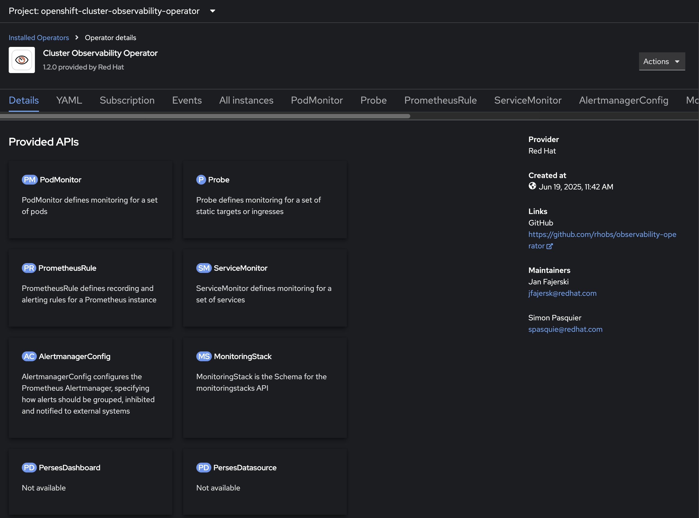

# Perses example

This example creates dashboards using Perses, a dashboard tool to display observability data.

This example will demonstrate how to install and configure it on OpenShift Cluster.

- It can be installed by installing the Cluster Observability Operator (COO), available in the Operator Hub



Once the operator is ready, the first step is:

- create the monitoring namespace
```bash
oc new-project monitoring
```

- Create the Perses Instance
```bash
oc create -f assets/perses-instance.yaml
```

- Create a route to expose the Perses deployment:
```bash
# the perses service is already created by the COO
oc create route edge perses --service=perses --port=8080 --insecure-policy=Allow -n monitoring
# then
HOST=$(oc get routes -n monitoring -o jsonpath='{.items[*].spec.host}')
```

- Log in with `percli` (optional, useful to migrate Grafana dashboards)
```
# use the exposed route from the previous command:
percli login http://$HOST
```

- Deploy a test dashboard to make sure it is working properly:
```bash
oc create of  -f assets/perses-dashboard-example.yaml
# then check if it is working
oc describe persesdashboards/perses-dashboard-sample
...
Status:
  Conditions:
    Last Transition Time:  2025-06-19T18:24:23Z
    Message:               Dashboard (perses-dashboard-sample) created successfully
    Reason:                Reconciling
    Status:                True <1>
    Type:                  Available
Events:                    <none>
```
<1> - it should be true.

Now we need to create the `PersesDataSource`. First configure the service account so Perses can query the `Thanos` endpoint. Apply the content from [service account role binding](./assets/sa-rb.yaml)

This will:
- create the service account `perses-sa`
  - For newer versions, the `perses-sa` service account may already exist.
 - Create the secret token for the service account
- assign the `cluster-monitoring-view` to the service account just created.

```bash
oc apply -f assets/sa-rb.yaml
```

Now, let's get the `serviceAccount` token and store in a secret:
```bash
SECRET_NAME=$(oc -n monitoring describe sa perses-sa | awk '/Tokens/{ print $2 }')
# echo $SECRET_NAME
# grafana-sa-token-zsx9b
TOKEN=$(oc -n monitoring get secret $SECRET_NAME --template='{{ .data.token | base64decode }}')
# echo $TOKEN
# eyJhbGciOiJSUzI1NiIsI.....
```

With the token ready, store it into a secret for the next step:
```bash
oc apply -f - <<EOF
kind: Secret
apiVersion: v1
metadata:
  name: credentials
  namespace: monitoring
stringData:
  authorization: Bearer ${TOKEN}
type: Opaque
EOF

# Check if the secret was created and has the token
oc get secret credentials -oyaml -n monitoring
```

At this point, create the `PersesDatasource`:
```
oc create -f assets/perses-datasource.yaml
```


## Migrating Grafana dashboards

For NVIDIA we have a Grafana dashboard that can be converted to a Perses dashboard.
To proceed, install `percli`, more information [here](https://perses.dev/perses/docs/cli/)

- Convert from Grafana to Perses
```bash
percli migrate -f nvidia/assets/grafana-dashboard.json --online -o yaml >  nvidia/assets/perses-dashboard.yaml
```